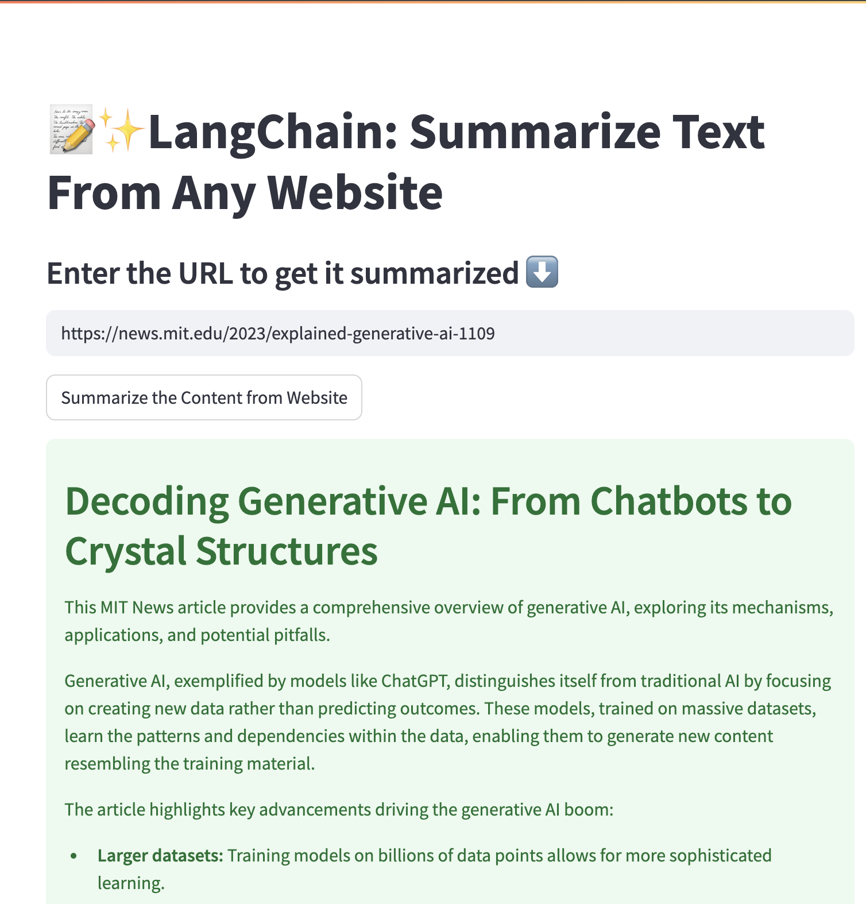

# 📝✨ LangChain: Webpage Summarizer

Summarize any website content into a concise 300-word summary with a title using this Streamlit app! Powered by LangChain, Groq’s blazing-fast Gemma-2 model, and Unstructured URL loader, this tool fetches webpage text and delivers clean summaries in seconds.



## 🚀 Features

- 🔗 Summarize any public website URL.
- ⚡ Uses Groq's Gemma-2 LLM via API for fast, high-quality summaries.
- 📄 Retrieves webpage text using `UnstructuredURLLoader`.
- 📝 Outputs a 300-word summary with a relevant title.
- 🌐 Simple Streamlit-based web UI.

---

## 2️⃣ Install Requirements

It’s recommended to use a virtual environment:

```bash
pip install -r requirements.txt
```

**Required Packages (ensure compatibility):**

- `streamlit`
- `langchain`
- `langchain_groq`
- `langchain_community`
- `validators`
- `unstructured`

---

## 3️⃣ Configure API Key

No `.env` file needed!  
Just enter your **Groq API Key** directly in the sidebar when you launch the app.

- Get your Groq API Key from [Groq Cloud](https://console.groq.com/keys).

---

## 4️⃣ Run the App

```bash
streamlit run app.py
```

Then open `http://localhost:8501` in your browser.

---

## 🔑 Usage Instructions

1. 🔒 Enter your Groq API Key in the sidebar.
2. 🌐 Paste the URL you want summarized.
3. ✨ Click **"Summarize the Content from Website"**.
4. ✅ Get the summary and title right below!

---

## 📂 Project Structure

```bash
├── app.py             # Streamlit app (main script)
├── requirements.txt   # Python dependencies
├── screenshot.png     # Optional app screenshot
└── README.md          # Project documentation
```

---

## 🔥 Technologies Used

- **LLM:** [Gemma2-9b-it](https://groq.com) via Groq API
- **Framework:** LangChain + Streamlit
- **Document Loader:** Unstructured URL Loader
- **Validation:** Python `validators` library

---

## 🙌 Acknowledgements

- [LangChain](https://github.com/langchain-ai/langchain)
- [Groq API](https://groq.com/)
- [Unstructured.io](https://unstructured.io/)

---

## 🛡️ License

This project is licensed under the [MIT License](LICENSE). Feel free to use, modify, and share with attribution.

---
## 📢 Connect with Me

Let's collaborate! Connect with me on:

[](https://www.linkedin.com/in/v-rithul-06b5632b6/)  

🚀 **Happy Coding!**
